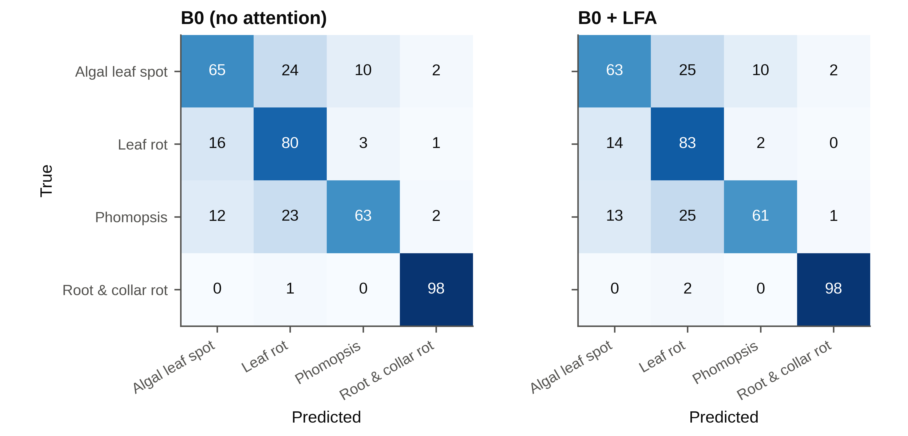
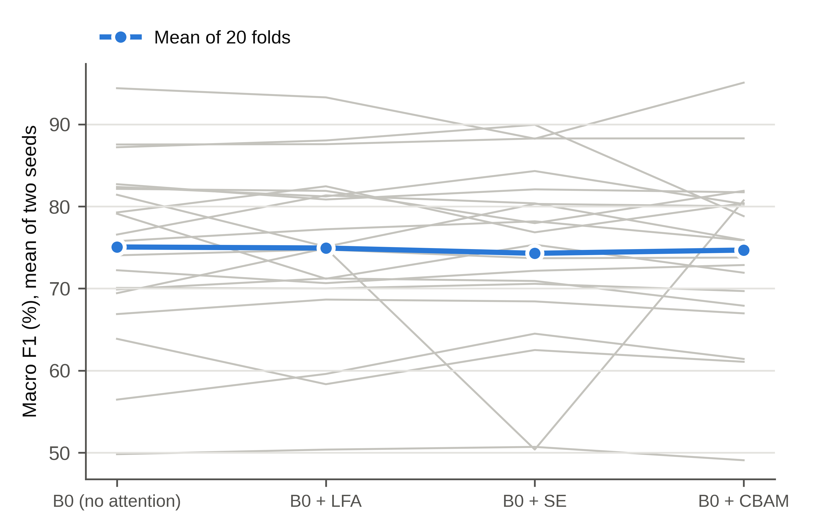

All tables and figures are generated by `paper/make_supplement.py` from the released result files (`results/preds.csv`, `results/results.csv`, `results/v2/results.csv`, `results/v3/*`, `results/numbers.json`, `paper/numbers.json` and `paper/numbers_v3.json`). The single-channel spatial gate (SG) is labelled `lfa` / LFA in the code, the result files and Figs. S1–S2, and the leaf blight complex is labelled `Leaf_rot`.

## Table S1. Per-class precision, recall and F1 (%, mean ± SD over runs in which the class was present), all test images

| Class | Configuration | Precision | Recall | F1 |
|---|---|---|---|---|
| Algal leaf spot | None | 72.9 ± 25.5 | 63.7 ± 18.4 | 65.3 ± 19.3 |
|  | SG | 73.8 ± 25.9 | 61.1 ± 21.2 | 63.6 ± 21.0 |
|  | SE | 72.8 ± 25.2 | 59.9 ± 20.6 | 62.5 ± 19.9 |
|  | CBAM | 74.1 ± 24.1 | 60.7 ± 21.8 | 63.6 ± 21.1 |
| Leaf blight complex | None | 66.6 ± 15.4 | 78.9 ± 16.0 | 70.7 ± 12.3 |
|  | SG | 66.9 ± 16.2 | 82.9 ± 15.1 | 71.8 ± 11.1 |
|  | SE | 64.8 ± 17.9 | 79.3 ± 20.1 | 69.4 ± 15.5 |
|  | CBAM | 66.0 ± 14.5 | 82.2 ± 12.3 | 71.8 ± 9.9 |
| *Phomopsis* leaf spot | None | 77.2 ± 20.5 | 78.6 ± 19.0 | 74.2 ± 13.4 |
|  | SG | 77.7 ± 20.2 | 76.7 ± 19.4 | 73.5 ± 13.9 |
|  | SE | 78.3 ± 20.9 | 78.9 ± 18.8 | 74.9 ± 14.7 |
|  | CBAM | 77.0 ± 21.0 | 78.1 ± 20.4 | 73.4 ± 14.9 |
| Root and collar rot | None | 91.0 ± 18.3 | 99.3 ± 2.1 | 93.6 ± 14.2 |
|  | SG | 92.3 ± 16.2 | 99.0 ± 2.2 | 94.6 ± 11.6 |
|  | SE | 91.2 ± 18.3 | 99.3 ± 1.5 | 93.8 ± 14.2 |
|  | CBAM | 91.5 ± 17.3 | 99.2 ± 2.0 | 94.0 ± 13.1 |

## Table S2. Accuracy (%, mean ± SD over 40 runs) and paired difference from the plain network over 20 folds (corrected resampled *t*-test)

| Configuration | Accuracy | Difference (pp) [95% CI] | *p*, corrected | Folds higher |
|---|---|---|---|---|
| None | 75.95 ± 9.33 | – | – | – |
| SG | 75.47 ± 10.09 | −0.49 [−4.67, 3.70] | 0.811 | 9/20 |
| SE | 74.75 ± 10.93 | −1.20 [−8.79, 6.39] | 0.744 | 10/20 |
| CBAM | 75.78 ± 9.66 | −0.17 [−4.82, 4.47] | 0.939 | 10/20 |

## Table S3. Preliminary experiment: eight runs per configuration on one fixed five-class split (earlier code; training randomness not controlled by the seed, so replicates are unpaired)

| Configuration | Macro F1, mean ± SD | Difference from none (pp) | *p*, Welch *t* | *p*, Mann–Whitney |
|---|---|---|---|---|
| None | 77.55 ± 1.91 | – | – | – |
| SG | 78.05 ± 2.61 | +0.50 | 0.671 | 0.958 |
| SE | 76.63 ± 3.75 | −0.92 | 0.551 | 0.752 |
| CBAM | 77.10 ± 2.86 | −0.45 | 0.718 | 0.833 |

## Table S4. Macro F1 averaged over all four classes (an absent class scored as zero), as stored by the training notebooks and used in the pre-specified decision rule

| Configuration | Macro F1 (%), mean ± SD | Paired difference (pp) [95% CI] | *p*, corrected | Meets rule (≥ 2 pp and CI > 0) |
|---|---|---|---|---|
| None | 72.44 ± 13.05 | – | – | – |
| SG | 72.32 ± 13.08 | −0.12 [−4.54, 4.30] | 0.954 | no |
| SE | 71.63 ± 13.45 | −0.82 [−7.63, 6.00] | 0.805 | no |
| CBAM | 72.18 ± 13.43 | −0.27 [−5.11, 4.57] | 0.909 | no |

## Table S5. Training settings (identical for all configurations)

| Item | Setting |
|---|---|
| Backbone | EfficientNet-B0, torchvision ImageNet weights (IMAGENET1K_V1) |
| Input | Train: RandomResizedCrop(224, scale 0.7–1.0). Evaluation: Resize(256) on the short side, CenterCrop(224) |
| Augmentation | Horizontal flip p = 0.5; vertical flip p = 0.3; RandomAffine (rotation ±20°, translation 5 %, scale 0.95–1.05); ColorJitter (brightness 0.3, contrast 0.3, saturation 0.2, hue 0.05); GaussianBlur (kernel 3–7, σ 0.1–1.5); ImageNet normalisation; RandomErasing p = 0.3, 2–10 % of the image |
| Classifier head | Dropout p = 0.3, Linear(1280, 4) |
| Stage 1 | 15 epochs, backbone frozen (BatchNorm statistics still updating), Adam, lr 1e-3, attention module + head trained |
| Stage 2 | 15 epochs, all parameters trainable, Adam, lr 1e-5, starting from the best stage-1 checkpoint |
| Checkpoint selection | Highest inner-validation macro F1 over both stages; inner validation ≈ 10 % of the training part, by whole groups |
| Loss and sampling | Cross-entropy with inverse-frequency class weights; WeightedRandomSampler with class weights |
| Batch size | 16 |
| Precision | Mixed precision (torch.autocast with a gradient scaler) |
| Seeds | 0 and 1 per fold; Python, NumPy, PyTorch, sampler and data-loader workers seeded; cuDNN deterministic |
| Hardware | Google Colab GPU runtime; PyTorch and torchvision |

## Table S6. Paired comparisons of macro F1 with the plain network under three tests over the 20 folds

| Configuration | Mean difference (pp) | *p*, corrected resampled *t* | *p*, uncorrected paired *t* | *p*, Wilcoxon signed-rank |
|---|---|---|---|---|
| SG | −0.13 | 0.953 | 0.870 | 0.898 |
| SE | −0.77 | 0.816 | 0.521 | 0.956 |
| CBAM | −0.38 | 0.879 | 0.675 | 0.277 |

## Table S7. Sensitivity to the grouping of video frames (Section 2.3 of the manuscript)

| Test images scored | Mean test images per fold | Configuration | Macro F1 (%), mean ± SD | Paired difference (pp) [95% CI] | *p*, corrected |
|---|---|---|---|---|---|
| All test images | 137.5 | None | 75.06 ± 10.86 | – | – |
| | | SG | 74.93 ± 10.95 | −0.13 [−4.56, 4.31] | 0.953 |
| | | SE | 74.29 ± 11.80 | −0.77 [−7.62, 6.08] | 0.816 |
| | | CBAM | 74.68 ± 10.78 | −0.38 [−5.48, 4.73] | 0.879 |
| Video frames excluded | 121.8 | None | 66.60 ± 12.04 | – | – |
| | | SG | 66.46 ± 12.15 | −0.13 [−4.55, 4.28] | 0.950 |
| | | SE | 65.34 ± 12.74 | −1.26 [−10.28, 7.76] | 0.773 |
| | | CBAM | 66.37 ± 13.06 | −0.23 [−5.83, 5.37] | 0.933 |
| Only images whose video-linked group was not split | 87.0 | None | 67.36 ± 12.17 | – | – |
| | | SG | 66.54 ± 12.34 | −0.83 [−6.09, 4.44] | 0.746 |
| | | SE | 64.54 ± 14.16 | −2.83 [−11.70, 6.04] | 0.512 |
| | | CBAM | 66.19 ± 14.53 | −1.17 [−7.96, 5.62] | 0.722 |

Without the video frames the mean seed difference was 5.67 points, and the SG was at least 3 points ahead of the plain network in 20.0 % of seed-matched pairs and at least 3 points behind in 22.5 %.

## Table S8. Model size, computation and CPU latency for one 224 × 224 image (median and 90th percentile of 200 passes, Colab CPU)

| Configuration | Parameters (M) | Added parameters | GMACs | 1 thread, median (ms) | 1 thread, p90 (ms) | 12 threads, median (ms) | 12 threads, p90 (ms) |
|---|---|---|---|---|---|---|---|
| None | 4.0127 | 0 | 0.3845 | 34.29 | 35.38 | 22.46 | 46.40 |
| SG | 4.0140 | 1,281 | 0.3846 | 34.18 | 35.39 | 22.65 | 23.92 |
| SE | 4.2175 | 204,800 | 0.3847 | 34.21 | 35.17 | 22.54 | 24.78 |
| CBAM | 4.2176 | 204,898 | 0.3850 | 35.20 | 35.86 | 23.29 | 27.03 |

## Table S9. Fold sizes and macro F1 per fold (%, mean of two seeds; † no root and collar rot image in the test fold)

| Repeat | Fold | Train | Validation | Test | None | SG | SE | CBAM |
|---|---|---|---|---|---|---|---|---|
| 0 | 0 | 440 | 58 | 52 | 94.40 | 93.28 | 88.25 | 95.07 |
| 0 | 1 | 386 | 41 | 123 | 75.76 | 77.22 | 78.18 | 75.87 |
| 0 | 2 | 275 | 28 | 247 | 63.87 | 58.34 | 62.51 | 61.07 |
| 0 | 3 | 388 | 34 | 128 | 82.14 | 81.89 | 77.97 | 81.90 |
| 1 | 0 | 453 | 42 | 55 | 79.10 | 71.19 | 75.34 | 71.92 |
| 1 | 1 | 395 | 46 | 109 | 76.57 | 81.34 | 80.37 | 75.90 |
| 1 | 2† | 296 | 30 | 224 | 49.82 | 50.38 | 50.71 | 49.08 |
| 1 | 3 | 348 | 40 | 162 | 74.04 | 74.75 | 73.69 | 73.77 |
| 2 | 0† | 419 | 51 | 80 | 72.23 | 70.65 | 72.16 | 72.86 |
| 2 | 1 | 256 | 35 | 259 | 66.89 | 68.65 | 68.43 | 66.97 |
| 2 | 2 | 443 | 46 | 61 | 82.37 | 81.21 | 84.31 | 80.29 |
| 2 | 3 | 358 | 42 | 150 | 81.42 | 75.09 | 80.30 | 80.01 |
| 3 | 0 | 393 | 61 | 96 | 69.43 | 74.90 | 50.39 | 80.74 |
| 3 | 1 | 424 | 46 | 80 | 70.07 | 70.00 | 70.57 | 69.69 |
| 3 | 2 | 247 | 23 | 280 | 69.88 | 71.23 | 70.92 | 67.90 |
| 3 | 3 | 417 | 39 | 94 | 87.54 | 87.58 | 88.28 | 88.29 |
| 4 | 0† | 459 | 50 | 41 | 87.21 | 88.04 | 89.95 | 78.82 |
| 4 | 1 | 381 | 34 | 135 | 82.71 | 80.84 | 82.08 | 81.72 |
| 4 | 2 | 309 | 31 | 210 | 56.47 | 59.59 | 64.50 | 61.42 |
| 4 | 3 | 342 | 44 | 164 | 79.27 | 82.45 | 76.84 | 80.39 |

## Figures S1 and S2

{ width=100% }

{ width=70% }

## Table S10. Per-class precision, recall and F1 (%, mean ± SD over runs in which the class was present), video frames excluded (primary scoring)

| Class | Configuration | Precision | Recall | F1 | Runs |
|---|---|---|---|---|---|
| Algal leaf spot | None | 73.1 ± 25.5 | 63.7 ± 18.4 | 65.4 ± 19.3 | 40 |
|  | SG | 74.1 ± 26.0 | 61.1 ± 21.2 | 63.7 ± 21.1 | 40 |
|  | SE | 73.1 ± 25.3 | 59.9 ± 20.6 | 62.5 ± 19.9 | 40 |
|  | CBAM | 74.6 ± 24.4 | 60.7 ± 21.8 | 63.7 ± 21.1 | 40 |
| Leaf blight complex | None | 67.5 ± 15.8 | 78.9 ± 16.0 | 71.1 ± 12.3 | 40 |
|  | SG | 68.0 ± 16.4 | 82.9 ± 15.1 | 72.5 ± 11.0 | 40 |
|  | SE | 65.9 ± 18.5 | 79.3 ± 20.1 | 69.9 ± 15.5 | 40 |
|  | CBAM | 66.7 ± 14.7 | 82.2 ± 12.3 | 72.2 ± 9.9 | 40 |
| *Phomopsis* leaf spot | None | 44.3 ± 44.2 | 29.4 ± 27.8 | 32.0 ± 31.6 | 32 |
|  | SG | 44.4 ± 45.0 | 27.0 ± 27.3 | 30.9 ± 31.7 | 32 |
|  | SE | 44.1 ± 44.0 | 31.0 ± 28.2 | 32.8 ± 32.3 | 32 |
|  | CBAM | 44.2 ± 44.4 | 28.6 ± 28.2 | 31.4 ± 31.7 | 32 |
| Root and collar rot | None | 91.0 ± 18.3 | 99.3 ± 2.1 | 93.6 ± 14.2 | 34 |
|  | SG | 92.3 ± 16.2 | 99.0 ± 2.2 | 94.6 ± 11.6 | 34 |
|  | SE | 91.2 ± 18.3 | 99.3 ± 1.5 | 93.8 ± 14.2 | 34 |
|  | CBAM | 91.5 ± 17.3 | 99.2 ± 2.0 | 94.0 ± 13.1 | 34 |

## Table S11. Backbone comparison: macro F1 and accuracy (%, mean ± SD over 40 runs) and paired difference from EfficientNet-B0 over 20 folds

Corrected resampled *t*-test (factor 0.383); Holm adjustment over the four comparisons; "rule" is the pre-specified criterion (difference of at least 2 pp and Holm *p* < 0.05).

| Scoring | Backbone | Macro F1 | Accuracy | Difference (pp) [95% CI] | *p*, corrected | *p*, Holm | *p*, uncorrected *t* | *p*, Wilcoxon | Folds higher | Rule met | Mean seed difference (pp) |
|--------------|----------------------|--------------|--------|------------------------|--------|--------|---------|---------|-------|------|---------|
| video frames excluded (primary) | EfficientNet-B0 | 66.65 ± 12.20 | 72.82 | – | – | – | – | – | – | – | 5.61 |
| | MobileNetV3-Large | 64.39 ± 14.42 | 72.15 | −2.26 [−9.47, 4.95] | 0.520 | 0.520 | 0.0851 | 0.1327 | 8/20 | no | 5.94 |
| | MobileNetV4-Conv-Medium | 58.30 ± 12.67 | 66.53 | −8.36 [−16.38, −0.33] | 0.042 | 0.126 | < 0.0001 | < 0.0001 | 2/20 | no | 7.42 |
| | ConvNeXt V2-Tiny | 74.81 ± 12.10 | 82.89 | +8.16 [1.87, 14.45] | 0.014 | 0.055 | < 0.0001 | < 0.0001 | 18/20 | no | 3.79 |
| | ViT-S/16 | 74.96 ± 12.20 | 82.32 | +8.30 [−0.19, 16.80] | 0.055 | 0.126 | < 0.0001 | < 0.0001 | 18/20 | no | 4.68 |
| all test images | EfficientNet-B0 | 75.19 ± 11.20 | 75.87 | – | – | – | – | – | – | – | 5.15 |
| | MobileNetV3-Large | 73.68 ± 12.55 | 75.38 | −1.52 [−8.23, 5.19] | 0.641 | 0.641 | 0.2055 | 0.2305 | 8/20 | no | 5.49 |
| | MobileNetV4-Conv-Medium | 68.50 ± 10.90 | 70.47 | −6.69 [−14.34, 0.96] | 0.083 | 0.166 | < 0.0001 | < 0.0001 | 3/20 | no | 6.69 |
| | ConvNeXt V2-Tiny | 84.10 ± 9.83 | 84.88 | +8.91 [1.65, 16.17] | 0.019 | 0.075 | < 0.0001 | < 0.0001 | 19/20 | no | 3.51 |
| | ViT-S/16 | 83.67 ± 8.69 | 84.59 | +8.48 [0.18, 16.77] | 0.046 | 0.137 | < 0.0001 | < 0.0001 | 19/20 | no | 4.94 |

ConvNeXt V2-Tiny minus ViT-S/16 (exploratory, video frames excluded): −0.15 pp [−5.65, 5.36], corrected *p* = 0.956.

## Table S12. Per-class precision, recall and F1 (%, mean ± SD over runs in which the class was present), backbone experiment, video frames excluded

| Class | Backbone | Precision | Recall | F1 | Runs |
|------------------|--------------------------|--------------|--------------|--------------|------|
| Algal leaf spot | EfficientNet-B0 | 73.4 ± 25.6 | 62.7 ± 20.4 | 64.4 ± 20.0 | 40 |
|  | MobileNetV3-Large | 69.5 ± 24.3 | 61.2 ± 23.3 | 63.3 ± 23.0 | 40 |
|  | MobileNetV4-Conv-Medium | 64.5 ± 27.9 | 53.0 ± 21.9 | 54.6 ± 21.2 | 40 |
|  | ConvNeXt V2-Tiny | 74.1 ± 25.5 | 85.4 ± 13.0 | 77.0 ± 20.8 | 40 |
|  | ViT-S/16 | 76.3 ± 24.6 | 80.4 ± 16.3 | 76.1 ± 20.4 | 40 |
| Leaf blight complex | EfficientNet-B0 | 67.8 ± 14.6 | 80.3 ± 16.2 | 72.0 ± 12.2 | 40 |
|  | MobileNetV3-Large | 67.1 ± 15.0 | 74.8 ± 17.0 | 68.8 ± 12.1 | 40 |
|  | MobileNetV4-Conv-Medium | 58.5 ± 14.7 | 70.7 ± 22.0 | 61.2 ± 15.0 | 40 |
|  | ConvNeXt V2-Tiny | 83.7 ± 9.5 | 79.4 ± 14.9 | 80.7 ± 10.8 | 40 |
|  | ViT-S/16 | 81.0 ± 14.6 | 78.3 ± 13.2 | 78.6 ± 11.2 | 40 |
| *Phomopsis* leaf spot | EfficientNet-B0 | 45.0 ± 45.0 | 28.5 ± 26.9 | 31.9 ± 31.7 | 32 |
|  | MobileNetV3-Large | 39.0 ± 41.0 | 28.2 ± 32.4 | 30.9 ± 33.8 | 32 |
|  | MobileNetV4-Conv-Medium | 46.4 ± 44.9 | 25.4 ± 25.9 | 30.6 ± 30.2 | 32 |
|  | ConvNeXt V2-Tiny | 47.2 ± 46.7 | 33.6 ± 33.6 | 38.6 ± 38.0 | 32 |
|  | ViT-S/16 | 44.3 ± 44.4 | 41.5 ± 39.6 | 41.4 ± 40.8 | 32 |
| Root and collar rot | EfficientNet-B0 | 91.8 ± 17.6 | 99.7 ± 1.0 | 94.4 ± 12.8 | 34 |
|  | MobileNetV3-Large | 87.0 ± 22.4 | 98.8 ± 2.3 | 90.3 ± 18.2 | 34 |
|  | MobileNetV4-Conv-Medium | 78.3 ± 25.1 | 95.2 ± 17.1 | 83.9 ± 22.4 | 34 |
|  | ConvNeXt V2-Tiny | 99.8 ± 1.4 | 97.0 ± 10.2 | 98.0 ± 6.6 | 34 |
|  | ViT-S/16 | 99.4 ± 2.0 | 100.0 ± 0.0 | 99.7 ± 1.0 | 34 |

## Table S13. Recall (%) for *Phomopsis* leaf spot, still photographs against video frames, pooled over the 40 runs of each backbone (all test images)

| Backbone | Still photographs | Video frames |
|------------------------|--------------|--------------|
| EfficientNet-B0 | 42.9 | 96.2 |
| MobileNetV3-Large | 46.3 | 97.6 |
| MobileNetV4-Conv-Medium | 43.8 | 94.8 |
| ConvNeXt V2-Tiny | 58.4 | 97.8 |
| ViT-S/16 | 71.7 | 98.9 |

## Table S14. Referral to the grower: the threshold on the maximum softmax probability is chosen on the inner-validation images only (smallest threshold at which the accepted validation images reach the target accuracy; all images are referred if none does)

*Coverage*: share of test images decided by the model. *Accuracy decided*: mean over runs with at least one decided image (pooled over images in brackets). *Accuracy, no referral*: accuracy if every image were decided (pooled). *Below target*: runs in which the accuracy on decided images was below the target. *All decided*: runs in which every test image was decided. Referral shares are means over runs in which the class was present.

| Scoring | Target | Backbone | Coverage (%) | Accuracy decided (%) | Accuracy, no referral (%) | Below target | All decided | Referred: Algal | Referred: Leaf blight | Referred: *Phomopsis* | Referred: Root rot |
|-------------|-------|----------------------|-------------|-----------------|----------|--------|--------|--------|--------|---------|--------|
| video frames excluded (primary) | 90 % | EfficientNet-B0 | 65.0 ± 33.5 | 83.3 ± 12.1 (79.0) | 70.8 | 22/39 | 3/40 | 42.3 | 33.1 | 51.6 | 10.3 |
| | | MobileNetV3-Large | 54.3 ± 34.4 | 84.4 ± 12.1 (78.6) | 69.8 | 24/38 | 2/40 | 50.6 | 49.7 | 57.8 | 16.7 |
| | | MobileNetV4-Conv-Medium | 57.8 ± 30.8 | 79.4 ± 13.3 (73.6) | 64.8 | 29/37 | 0/40 | 48.8 | 41.7 | 62.7 | 16.7 |
| | | ConvNeXt V2-Tiny | 89.1 ± 18.9 | 86.4 ± 9.0 (83.6) | 80.5 | 21/40 | 9/40 | 12.0 | 11.5 | 14.4 | 3.3 |
| | | ViT-S/16 | 87.5 ± 17.8 | 86.1 ± 7.7 (84.6) | 81.1 | 24/40 | 8/40 | 12.8 | 14.0 | 12.3 | 0.3 |
| video frames excluded (primary) | 95 % | EfficientNet-B0 | 52.5 ± 32.0 | 87.2 ± 11.0 (81.5) | 70.8 | 29/39 | 2/40 | 53.9 | 48.7 | 65.4 | 13.2 |
| | | MobileNetV3-Large | 39.8 ± 28.3 | 90.4 ± 11.0 (85.2) | 69.8 | 19/37 | 0/40 | 68.8 | 65.8 | 78.8 | 20.6 |
| | | MobileNetV4-Conv-Medium | 44.9 ± 27.4 | 84.0 ± 13.1 (77.1) | 64.8 | 27/37 | 0/40 | 64.3 | 56.3 | 76.7 | 18.4 |
| | | ConvNeXt V2-Tiny | 83.2 ± 23.9 | 88.4 ± 8.5 (85.6) | 80.5 | 30/40 | 8/40 | 18.2 | 19.4 | 22.8 | 5.0 |
| | | ViT-S/16 | 75.9 ± 25.7 | 89.6 ± 7.3 (86.7) | 81.1 | 29/40 | 4/40 | 24.7 | 27.2 | 29.4 | 0.5 |
| all test images | 90 % | EfficientNet-B0 | 72.6 ± 27.8 | 84.0 ± 10.9 (80.9) | 73.7 | 22/39 | 3/40 | 37.0 | 26.4 | 22.2 | 3.3 |
| | | MobileNetV3-Large | 61.1 ± 33.3 | 85.6 ± 11.2 (80.3) | 73.0 | 23/39 | 2/40 | 44.3 | 43.1 | 37.7 | 16.4 |
| | | MobileNetV4-Conv-Medium | 67.0 ± 28.0 | 81.1 ± 11.7 (76.2) | 68.2 | 28/38 | 0/40 | 42.3 | 35.7 | 25.1 | 12.7 |
| | | ConvNeXt V2-Tiny | 90.8 ± 16.4 | 88.0 ± 8.1 (85.2) | 82.5 | 20/40 | 8/40 | 11.5 | 10.6 | 7.1 | 3.3 |
| | | ViT-S/16 | 92.4 ± 9.7 | 87.0 ± 7.2 (85.5) | 83.1 | 22/40 | 10/40 | 9.3 | 9.7 | 3.8 | 0.3 |
| all test images | 95 % | EfficientNet-B0 | 60.8 ± 30.2 | 87.6 ± 10.5 (82.8) | 73.7 | 25/39 | 2/40 | 49.0 | 41.6 | 34.0 | 10.9 |
| | | MobileNetV3-Large | 47.5 ± 30.3 | 89.7 ± 10.7 (85.3) | 73.0 | 22/39 | 1/40 | 62.8 | 60.1 | 51.8 | 17.9 |
| | | MobileNetV4-Conv-Medium | 56.7 ± 26.9 | 84.7 ± 12.3 (78.6) | 68.2 | 26/38 | 0/40 | 55.7 | 47.6 | 31.9 | 16.1 |
| | | ConvNeXt V2-Tiny | 86.1 ± 21.6 | 89.5 ± 7.5 (86.8) | 82.5 | 31/40 | 8/40 | 17.3 | 16.4 | 11.3 | 3.4 |
| | | ViT-S/16 | 82.3 ± 21.9 | 89.8 ± 6.8 (87.6) | 83.1 | 33/40 | 5/40 | 20.3 | 22.6 | 11.0 | 0.5 |

## Table S15. Threshold-free confidence ranking: accuracy on the most confident images at fixed coverage, area under the risk–coverage curve (AURC, lower is better) and top-2 accuracy (%, mean over 40 runs; video frames excluded)

| Backbone | 50 % coverage | 70 % coverage | 80 % coverage | 100 % (accuracy) | AURC (mean ± SD) | Top-2 accuracy (mean ± SD) |
|----------------------|-----------|-----------|-----------|-----------|---------------|---------------|
| EfficientNet-B0 | 87.3 | 80.9 | 78.5 | 72.8 | 13.27 ± 8.91 | 93.48 ± 5.09 |
| MobileNetV3-Large | 86.4 | 81.2 | 77.5 | 72.1 | 13.80 ± 9.20 | 92.83 ± 5.83 |
| MobileNetV4-Conv-Medium | 82.6 | 75.7 | 73.1 | 66.5 | 17.80 ± 9.77 | 91.60 ± 5.86 |
| ConvNeXt V2-Tiny | 94.3 | 90.7 | 88.8 | 82.9 | 6.47 ± 6.80 | 96.90 ± 2.59 |
| ViT-S/16 | 94.2 | 91.2 | 89.2 | 82.3 | 6.32 ± 5.82 | 96.13 ± 2.33 |

Exploratory paired comparisons with EfficientNet-B0 over 20 folds (corrected resampled *t*-test, Holm over four comparisons; no test of these quantities was pre-specified):

| Backbone | AURC difference [95% CI] | *p* | *p*, Holm | Top-2 difference (pp) [95% CI] | *p* | *p*, Holm |
|----------------------|--------------------|-------|--------|--------------------|-------|--------|
| MobileNetV3-Large | +0.53 [−6.67, 7.73] | 0.879 | 0.879 | −0.65 [−3.65, 2.35] | 0.655 | 0.815 |
| MobileNetV4-Conv-Medium | +4.53 [−2.62, 11.68] | 0.201 | 0.401 | −1.88 [−6.12, 2.35] | 0.364 | 0.815 |
| ConvNeXt V2-Tiny | −6.80 [−12.54, −1.07] | 0.023 | 0.079 | +3.42 [−1.61, 8.45] | 0.171 | 0.683 |
| ViT-S/16 | −6.95 [−12.67, −1.24] | 0.020 | 0.079 | +2.64 [−2.25, 7.54] | 0.272 | 0.815 |

## Table S16. Rerun agreement, model size and CPU latency

EfficientNet-B0 was retrained in the backbone experiment (same folds, seeds and schedule; `drop_last` in the training loader, as required by MobileNetV4). Its mean macro F1 was 66.65 % (video frames excluded) against 66.60 % in the first experiment; the mean absolute difference between matching runs was 3.02 points (correlation 0.93). On all test images the values were 75.19 % and 75.06 % (mean absolute difference 2.63 points).

| Backbone | Parameters (M) | CPU latency, 1 thread, median (ms) | p90 (ms) | Mean training time per run (min) |
|------------------------|------------|--------------------|----------|----------------|
| EfficientNet-B0 | 4.013 | 36.71 | 50.15 | 2.74 |
| MobileNetV3-Large | 4.207 | 29.05 | 32.63 | 2.65 |
| MobileNetV4-Conv-Medium | 8.440 | 43.25 | 68.56 | 2.72 |
| ConvNeXt V2-Tiny | 27.870 | 163.44 | 219.13 | 2.96 |
| ViT-S/16 | 21.667 | 100.82 | 113.68 | 2.63 |

## Table S17. Sensitivity to the grouping of video frames: backbone comparison on test images whose video-linked group was not split

Mean test images per fold: 87.0. Corrected resampled *t*-test over 20 folds; Holm adjustment over the four comparisons.

| Backbone | Macro F1 (%), mean ± SD | Difference from EfficientNet-B0 (pp) [95% CI] | *p*, corrected | *p*, Holm | Folds higher |
|--------------------------|------------------|----------------------------|----------|----------|----------|
| EfficientNet-B0 | 67.00 ± 13.29 | – | – | – | – |
| MobileNetV3-Large | 63.25 ± 12.51 | −3.74 [−13.10, 5.61] | 0.413 | 0.413 | 6/20 |
| MobileNetV4-Conv-Medium | 56.87 ± 14.10 | −10.13 [−21.07, 0.81] | 0.068 | 0.149 | 3/20 |
| ConvNeXt V2-Tiny | 74.04 ± 13.94 | +7.04 [0.68, 13.40] | 0.032 | 0.127 | 18/20 |
| ViT-S/16 | 73.82 ± 14.15 | +6.82 [0.01, 13.64] | 0.050 | 0.149 | 18/20 |

## Table S18. Optimism of the inner-validation images used for the referral threshold (video frames excluded)

Mean accuracy without any referral on the validation images and on the test folds (means of per-run values), and the number of runs (of 40) in which the validation accuracy was already at or above the target.

| Backbone | Validation accuracy (%) | Test accuracy (%) | Runs with validation accuracy ≥ 90 % | Runs with validation accuracy ≥ 95 % |
|--------------------------|----------------|--------------|------------------|------------------|
| EfficientNet-B0 | 81.0 | 72.8 | 16 | 11 |
| MobileNetV3-Large | 77.7 | 72.1 | 11 | 4 |
| MobileNetV4-Conv-Medium | 79.8 | 66.5 | 11 | 5 |
| ConvNeXt V2-Tiny | 93.2 | 82.9 | 32 | 25 |
| ViT-S/16 | 91.9 | 82.3 | 29 | 18 |
